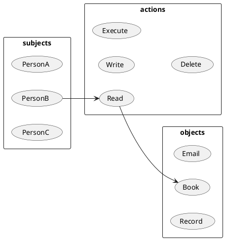

ACL - Access Control List
---

```plantuml
@startuml
left to right direction

rectangle subjects {
    (PersonA)
    (PersonB)
    (PersonC)
}

rectangle actions {
    (Read)
    (Write)
    (Execute)
    (Delete)    
}

rectangle objects {
    (Email)
    (Book)
    (Record)
}

PersonB --> Read
Read --> Book
@enduml
```

|subject| action|object|
|---|---|---|
|PersonA|Read|Book|
|PersonB|Read,Write|Book|
|PersonC|Execute|Record|

PersonA can read a book

